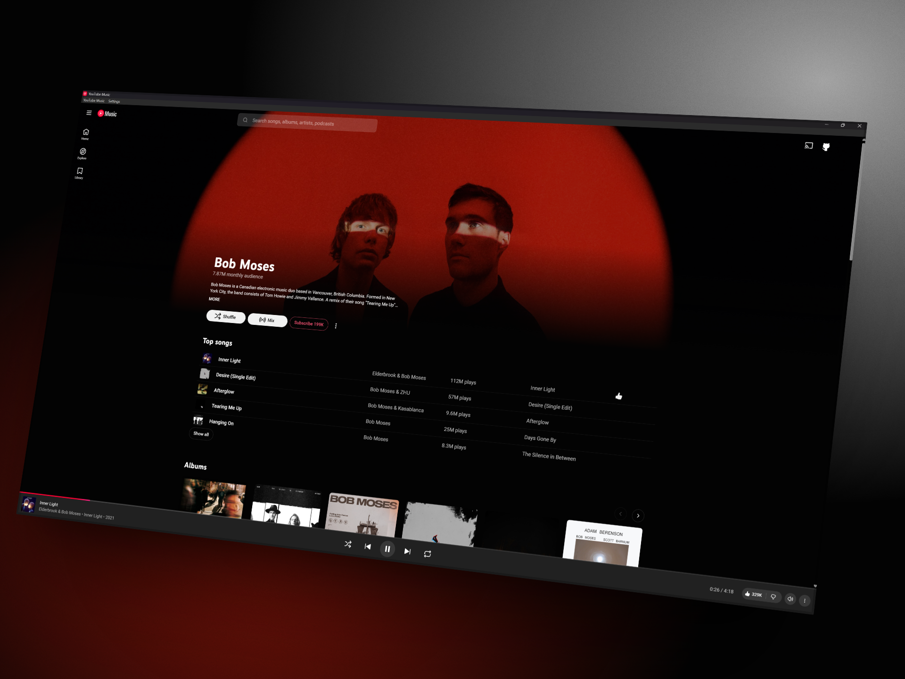

<h1 align="center">
  
  &nbsp;Ferric — YouTube Music for Windows
</h1>

<p align="center">
  Enjoy YouTube Music on your Windows desktop with a lightweight Rust app designed for significantly lower memory usage than Electron-based alternatives.
</p>

<p align="center">
  <a href="https://github.com/ShabGaming/ferric/releases"></a>
  <a href="LICENSE"></a>
  <a href="https://www.rust-lang.org/"></a>
  <a href="#download"></a>
  <a href="https://rust-lang.github.io/rustfmt/"></a>
</p>

<p align="center">
  <a href="https://github.com/ShabGaming/ferric/releases">Download</a> ·
  <a href="#features">Features</a> ·
  <a href="#build-from-source">Build from source</a> ·
  <a href="https://github.com/ShabGaming/ferric/issues">Report an issue</a>
</p>



## Disclaimer

You are using an independent, unofficial desktop client. You should not interpret the app, its contributors, name, icon, or screenshots as affiliation with, authorization by, sponsorship from, or endorsement by Google LLC or YouTube.

You see references to Google LLC's trademarks, including **Google**, **YouTube**, and **YouTube Music**, solely to identify the service. You do not receive any ownership of or rights to these names, marks, or associated logos by using this app.

You use the app as provided, without warranty, under the [MIT license](LICENSE). Your playback, advertisements, subscriptions, and audio quality remain subject to the official YouTube Music service.

## Features

- **Your familiar player.** Use the official YouTube Music interface with your playlists, recommendations, and account settings.
- **System tray.** Close your window to keep music playing, then click the tray icon to return.
- **Startup on your terms.** Enable Windows startup to launch into the tray; open your player when you need it.
- **Windows media controls.** Control your music with play, pause, previous, and next buttons in the Windows media panel.
- **Persistent sign-in.** Keep your account session across app restarts with a dedicated WebView2 profile.
- **One running instance.** Launch again to restore your existing player.
- **A lightweight desktop shell.** Use your installed WebView2 runtime, with a lower memory target while your player is in the background.

## Performance

You get a Rust and Tauri shell around the official web player, using your installed WebView2 runtime. When you move away from the player, you get WebView2's low-memory target; returning to your window restores the normal target. You can keep playback running in either state. You can expect an estimated **64–74% reduction in resident RAM usage** compared to electron counterparts.

## Download

You need **64-bit Windows 10 or Windows 11**, an internet connection, and the [Microsoft Edge WebView2 Runtime](https://developer.microsoft.com/en-us/microsoft-edge/webview2/).

### Installer

1. Download `YouTube-Music-1.0.0-windows-x64-setup.exe` from [Releases](https://github.com/ShabGaming/ferric/releases).
2. Run the installer to install for your Windows account. You will be prompted to install WebView2 if you need it.
3. Open **YouTube Music** from the **Ferric** folder in your Start menu and sign in.

You may see an unknown-publisher notice from Windows because your download is not code-signed.

You can view each download's SHA-256 checksum beside its asset on the GitHub release page.

### Portable app

1. Download `YouTube-Music-1.0.0-windows-x64.zip` from [Releases](https://github.com/ShabGaming/ferric/releases).
2. Extract the ZIP to a folder you want to keep, such as `%LOCALAPPDATA%\Programs\Ferric`.
3. Run **YouTube Music.exe** and sign in to your YouTube Music account.

You can launch **YouTube Music** from the **Ferric** folder in your Start menu after your first run. Keep your extracted folder in place so your shortcut and optional startup entry continue to work.

## Desktop controls

You can change your preferences through the window's **Settings** menu or by right-clicking your tray icon.

| Control | Your result | Default |
| --- | --- | --- |
| Open YouTube Music | Restore your player window | — |
| Run on Windows startup | Start in your tray when you sign in to Windows | Off |
| Close to tray | Keep your music playing when you close the window | On |
| Exit | Shut down your player and its WebView2 processes | — |

You can click your tray icon to reopen the player, or choose **YouTube Music > Exit** in the window menu to quit. Disable **Close to tray** if you prefer to exit with the window's close button.

### Your data

Your settings and sign-in profile stay under `%LOCALAPPDATA%\Ferric`:

- `settings.json`: your close-to-tray preference.
- `webview/`: your WebView2 browser profile and account session.

Your startup preference uses your Windows account's Run registry key. You can replace your executable with a newer build without discarding your existing profile. Run the new build once to refresh your Start menu shortcut and any enabled startup entry.

## Build from source

You need [Rust through rustup](https://rustup.rs/), Visual Studio's **Desktop development with C++** workload, a Windows SDK, and WebView2. You can follow [Tauri's Windows prerequisites](https://v2.tauri.app/start/prerequisites/#windows) to set up your build environment.

Your toolchain version is pinned in [rust-toolchain.toml](rust-toolchain.toml). You do not need Node.js to build or run the app.

```powershell
git clone https://github.com/ShabGaming/ferric.git
cd ferric
cargo run -p ferric --locked
```

To build your portable release package, quit your running copy and run:

```powershell
.\scripts\Build-Release.ps1
```

You will find your executable at `target/releases/1.0.0/YouTube Music.exe` and your versioned ZIP under `target/releases/`. You can also build only the executable with `cargo build -p ferric --release --locked`; your Cargo output is `target/release/youtube-music.exe`.

To also build your Windows installer, install the pinned Tauri CLI and run:

```powershell
cargo install tauri-cli --version 2.12.1 --locked
.\scripts\Build-Release.ps1 -WithInstaller
```

You will find your setup executable alongside your ZIP in `target/releases/`.

## Contributing

You can report bugs, suggest improvements, or submit a focused pull request. Before you open a pull request, run:

```powershell
cargo fmt --all -- --check
cargo clippy --workspace --all-targets --locked -- -D warnings
cargo test --workspace --locked
```

For changes to playback or desktop behavior, also check your release build with sign-in, media buttons, tray playback, and window restoration. You can use [Conventional Commits](https://www.conventionalcommits.org/en/v1.0.0/) prefixes, such as `feat:`, `fix:`, or `docs:`, with short imperative subjects.

## License

You can use, modify, and distribute the app under the [MIT license](LICENSE).
